# Pace Calculator - AI-Assisted Development Learning Project

[](https://vitest.dev/)
[](https://www.w3.org/WAI/WCAG21/quickref/)
[](https://github.com/actions)

> A modern, accessible running pace calculator that serves as an educational exploration of Claude Code capabilities and software engineering best practices, with intentional over-engineering for learning purposes.

## 🎓 Learning Objectives

This project was created as a comprehensive learning exercise to explore:

### **Primary Learning Goals**
- **AI-Assisted Development**: Investigating Claude Code's capabilities for modern web development
- **Software Engineering Excellence**: Implementing production-ready practices in a learning context
- **Accessibility-First Design**: WCAG 2.1 AA compliance as a foundational requirement
- **Modern JavaScript Patterns**: ES6+ modules, modern testing, and build tooling

### **Claude Code Exploration**
- Effective prompting strategies for complex development tasks
- AI-human collaboration patterns in software architecture
- Automated code quality enforcement with AI assistance
- Documentation-driven development with AI support

### **Intentional Over-Engineering**
This project deliberately includes enterprise-level complexity for educational value:
- **6 theme variants** (including accessibility themes) for a simple calculator
- **Comprehensive automation infrastructure** with pre-commit hooks and CI/CD
- **470-line design token validation script** for color consistency
- **Multi-layered testing strategy** with 115+ unit tests and E2E coverage
- **Advanced accessibility features** beyond typical calculator needs

## 📊 Project Overview

A sophisticated running pace calculator that demonstrates modern web development practices while maintaining simplicity in user experience.

### **Core Functionality**
- **Tri-directional calculations**: Calculate pace, time, or distance from any two inputs
- **Flexible input formats**: Supports decimal, colon notation (MM:SS, H:MM:SS), and space-separated formats
- **Real-time validation** with immediate visual feedback and helpful error messages
- **Personal Records tracking** with localStorage persistence and data integrity
- **Copy-to-clipboard** functionality for easy result sharing

### **Advanced Features**
- **6 Theme System**: Light, Dark, System, AMOLED, High-Contrast, Monochrome
- **Accessibility Excellence**: Screen reader support, keyboard navigation, focus management
- **Mobile Optimization**: Touch-friendly targets, input auto-advancement, responsive design
- **Progressive Enhancement**: Works without JavaScript, enhanced with it

### **Technology Stack**
```
Frontend:     Vanilla JavaScript (ES6+) - 1,200+ lines of application code
Build Tool:   Vite 6.x with hot module replacement
Styling:      TailwindCSS 3.x with design token system
Testing:      Vitest (unit) + Playwright (E2E) + Lighthouse CI
Quality:      ESLint + Stylelint + Custom design token validation
CI/CD:        GitHub Actions + Dependabot + Pre-commit hooks
```

## 🏗️ Architecture and Engineering Patterns

### **Design System Architecture**
The project implements an advanced **semantic design token system** that automatically adapts to accessibility requirements:

```css
/* Semantic tokens that change based on theme */
:root {
  --color-interactive-primary: #4f46e5;
  --color-surface: #ffffff;
  --color-text-primary: #111827;
}

.dark {
  --color-interactive-primary: #6366f1;
  --color-surface: #1f2937;
  --color-text-primary: #f9fafb;
}

.high-contrast {
  --color-interactive-primary: #000000;
  --color-surface: #ffffff;
  --color-text-primary: #000000;
}
```

This enables **automatic accessibility compliance** - when users select high-contrast or monochrome themes, all components automatically receive appropriate color values without manual intervention.

### **Modular JavaScript Architecture**
```
src/
├── calculator.js     # Pure calculation logic with comprehensive validation
├── ui.js            # DOM manipulation and user interaction handling
├── state.js         # Application state management with tab isolation
├── settings.js      # Theme management and accessibility preferences
├── pr.js           # Personal Records with localStorage integration
├── distances.js    # Race distance configuration and utilities
├── auto-advance.js # Input auto-advancement for mobile UX
├── touch.js        # Touch gesture handling and mobile optimization
└── main.js         # Application initialization and module coordination
```

### **Testing Strategy**
**Multi-layered approach with 115+ tests achieving comprehensive coverage:**

```bash
Unit Tests (Vitest):     60 calculator tests + 39 PR tests + 16 UI tests
E2E Tests (Playwright):  Critical paths + accessibility + theme switching
Lighthouse CI:           Performance + accessibility auditing (95% threshold)
Pre-commit:              Automated testing + linting + design token validation
```

### **Quality Automation Pipeline**

```mermaid
graph LR
    A[Code Change] --> B[Pre-commit Hook]
    B --> C[Design Token Validation]
    C --> D[ESLint + Stylelint]
    D --> E[Unit Tests]
    E --> F[Build Check]
    F --> G[Commit Success]
    
    G --> H[GitHub Actions]
    H --> I[Multi-Node Testing]
    I --> J[E2E Tests]
    J --> K[Accessibility Audit]
    K --> L[Security Audit]
    L --> M[Deploy Ready]
```



## 🤖 Claude Code Insights and Learnings

### **Effective AI-Assisted Development Patterns**

**1. Documentation-Driven Development**
Claude Code excels when provided with comprehensive project context via `CLAUDE.md`. Key discoveries:
- **Detailed conventions** enable consistent code generation across sessions
- **Architecture documentation** helps AI understand design decisions
- **Testing requirements** in documentation ensure AI writes appropriate tests

**2. Iterative Refinement Approach**
Most effective pattern discovered:
1. **High-level architecture** discussion with AI
2. **Implementation in chunks** with specific, focused prompts
3. **Incremental testing** and refinement
4. **Documentation updates** as understanding evolves

**3. Prompting Strategies That Work**
```bash
# Effective prompts discovered:
"Update the calculator logic to handle edge case X, following existing patterns"
"Add accessibility features to component Y, maintaining WCAG compliance"
"Refactor module Z to improve testability while preserving API"
"Create comprehensive tests for feature X covering edge cases A, B, C"
```

### **AI Collaboration Insights**

**Strengths Observed:**
- **Pattern recognition**: AI quickly adopts and maintains established code patterns
- **Best practices**: Automatically applies modern JavaScript and accessibility practices
- **Comprehensive testing**: Generates thorough test suites when given clear requirements
- **Documentation**: Excellent at creating and maintaining technical documentation

**Challenges Encountered:**
- **Context limitations**: Large codebases require careful context management
- **Design decisions**: AI needs human guidance for architectural choices
- **Custom tooling**: Required human oversight for complex automation scripts

**Successful Workflows:**
- **Task breakdown**: Breaking complex features into focused, manageable chunks
- **Incremental development**: Building features step-by-step with AI assistance
- **Code review cycles**: Using AI for implementation, human for architectural decisions

## 🚀 Getting Started

### **Prerequisites**
- Node.js 18+ 
- npm 9+
- Git

### **Quick Start**
```bash
git clone <repository-url>
cd pace-calculator
chmod +x update.sh
./update.sh              # Install, build, and test everything
./update.sh --dev        # Start development server
```

### **Development Commands**
```bash
# Development
npm run dev              # Start development server with HMR
npm run build            # Build for production
npm run preview          # Preview production build

# Testing  
npm run test             # Unit tests in watch mode
npm run test:run         # Unit tests once (CI mode)
npm run test:e2e         # Full E2E test suite
npm run test:e2e:smoke   # Critical path tests only

# Code Quality
npm run lint             # Run all linting (ESLint + Stylelint)
npm run lint:fix         # Auto-fix linting issues
npm run validate:tokens  # Validate design token usage
npm run validate:all     # Complete validation pipeline

# Utilities
npm run ci               # Full CI pipeline locally
npm run clean            # Clean build artifacts
```

## 📁 Project Structure

```
pace-calculator/
├── 📱 Application Code
│   ├── src/                    # 1,200+ lines of modular JavaScript
│   │   ├── calculator.js       # Pure calculation logic (300+ lines)
│   │   ├── ui.js              # DOM manipulation and interactions
│   │   ├── state.js           # Application state management
│   │   ├── settings.js        # Theme and accessibility features
│   │   ├── pr.js             # Personal records functionality
│   │   └── style.css         # Design system with 6 themes
│   └── index.html             # Semantic HTML structure
│
├── 🧪 Testing Infrastructure
│   ├── tests/unit/            # 115 unit tests (Vitest)
│   ├── tests/e2e/             # End-to-end tests (Playwright)
│   ├── vitest.config.js       # Unit testing configuration
│   └── playwright.config.js   # E2E testing setup
│
├── 🔧 Automation & Quality
│   ├── scripts/validate-tokens.js  # 470-line design token validator
│   ├── eslint.config.js           # Custom ESLint rules + hardcoded color detection
│   ├── stylelint.config.cjs       # CSS linting with design token enforcement
│   ├── .husky/pre-commit          # Multi-stage validation hooks
│   └── .github/workflows/         # CI/CD automation
│
├── 📚 Documentation
│   ├── CLAUDE.md              # Comprehensive development guidelines
│   ├── TASKS.md               # Current development roadmap
│   └── docs/archive/          # Implementation history
│
└── ⚙️ Configuration
    ├── vite.config.js         # Build configuration
    ├── tailwind.config.js     # Design system integration
    └── .vscode/settings.json  # Development environment
```

## 🎯 Areas of Intentional Over-Engineering

These aspects were deliberately over-engineered for learning purposes:

### **1. Design Token System Complexity**
- **6 complete theme variants** for a simple calculator
- **470-line validation script** to prevent hardcoded colors
- **Automatic accessibility adaptation** across themes
- **Learning Value**: Understanding enterprise design systems and accessibility compliance

### **2. Testing Infrastructure**
- **115+ comprehensive unit tests** for calculator logic
- **Multi-browser E2E testing** with Playwright
- **Accessibility audit automation** with Lighthouse CI
- **Learning Value**: Production-ready testing strategies and automation

### **3. Code Quality Automation**
- **Custom ESLint rules** for hardcoded color detection
- **Pre-commit hooks** with multi-stage validation
- **GitHub Actions workflows** with security auditing
- **Learning Value**: Enterprise-level code quality enforcement

### **4. Modular Architecture**
- **12 separate JavaScript modules** for a single-page app
- **Dependency injection patterns** for testability
- **Event-driven architecture** with custom event system
- **Learning Value**: Scalable architecture patterns and separation of concerns

## 📚 Learning Resources and References

### **Design System & Accessibility**
- [WCAG 2.1 Guidelines](https://www.w3.org/WAI/WCAG21/quickref/) - Accessibility compliance
- [Inclusive Design Principles](https://inclusivedesignprinciples.org/) - Universal design approach
- [Design Tokens W3C Standard](https://design-tokens.github.io/community-group/format/) - Token system architecture

### **Testing Strategies**
- [Testing Library Philosophy](https://testing-library.com/docs/guiding-principles) - User-centric testing
- [Vitest Documentation](https://vitest.dev/) - Modern unit testing framework
- [Playwright Best Practices](https://playwright.dev/docs/best-practices) - E2E testing patterns

### **Modern JavaScript Patterns**
- [ES6 Modules Best Practices](https://developer.mozilla.org/en-US/docs/Web/JavaScript/Guide/Modules)
- [JavaScript Testing Best Practices](https://github.com/goldbergyoni/javascript-testing-best-practices)
- [Modern JavaScript Project Structure](https://blog.logrocket.com/modern-javascript-project-structure/)

### **AI-Assisted Development**
- [Claude Code Documentation](https://docs.anthropic.com/en/docs/claude-code) - Official AI development tool guides
- [Prompt Engineering for Developers](https://www.deeplearning.ai/short-courses/chatgpt-prompt-engineering-for-developers/)

## 🚧 Development Insights and Challenges

### **Key Technical Decisions**

**1. Vanilla JavaScript Over Frameworks**
- **Decision**: Use vanilla JS instead of React/Vue/Angular
- **Rationale**: Focus on fundamental JavaScript patterns and DOM APIs
- **Learning**: Understanding the complexity that frameworks abstract away

**2. Comprehensive Accessibility Implementation**
- **Decision**: WCAG 2.1 AA compliance as a baseline requirement
- **Rationale**: Accessibility as a core engineering principle, not an afterthought
- **Learning**: How accessibility requirements drive better architecture decisions

**3. Design Token System Over CSS Variables**
- **Decision**: Semantic token naming with theme-aware adaptation
- **Rationale**: Scalable design system that automatically maintains accessibility
- **Learning**: How design systems enable consistent, maintainable UI at scale

### **Challenges Overcome**

**1. AI Context Management**
Large codebases presented context challenges with Claude Code:
- **Solution**: Comprehensive `CLAUDE.md` documentation with clear conventions
- **Learning**: Documentation quality directly impacts AI assistance effectiveness

**2. Testing Complex User Interactions**
Testing accessibility features and theme switching required sophisticated approaches:
- **Solution**: Multi-layered testing strategy with unit + E2E + automated auditing
- **Learning**: Different testing approaches serve different validation purposes

**3. Automation Without Brittleness**
Automated code quality checks needed to be strict but not fragile:
- **Solution**: Flexible pattern matching with escape hatches for legitimate exceptions
- **Learning**: Automation should enforce principles while allowing practical exceptions

## 🔮 Future Learning Opportunities

### **Technical Enhancements**
- [ ] **Progressive Web App (PWA)** implementation for offline functionality
- [ ] **Web Workers** for background calculations and data processing
- [ ] **WebAssembly** integration for performance-critical calculations
- [ ] **Internationalization (i18n)** with proper number formatting and RTL support

### **Advanced Testing Patterns**
- [ ] **Visual regression testing** with automated screenshot comparison
- [ ] **Performance regression testing** with benchmark tracking
- [ ] **Chaos engineering** principles for resilience testing
- [ ] **Property-based testing** for mathematical calculations

### **Architecture Evolution**
- [ ] **Micro-frontend** architecture exploration
- [ ] **Event sourcing** patterns for user interaction tracking
- [ ] **Functional programming** refactoring with immutable data structures
- [ ] **TypeScript** migration with advanced type system features

### **AI Development Exploration**
- [ ] **Claude Code workflow optimization** for larger projects
- [ ] **AI-assisted refactoring** techniques and best practices
- [ ] **Automated documentation generation** with AI assistance
- [ ] **AI pair programming** patterns for complex problem solving

## 📈 Project Metrics

**Codebase Statistics:**
- **JavaScript**: 1,200+ lines of application code
- **Tests**: 115 unit tests + comprehensive E2E coverage
- **Documentation**: 2,000+ lines of development guidelines
- **Automation**: 40+ npm scripts for development workflows

**Quality Metrics:**
- **Test Coverage**: 100% for core calculation logic
- **Accessibility Score**: 95%+ (Lighthouse CI requirement)
- **Build Time**: <5 seconds for development builds
- **Bundle Size**: <50KB gzipped for production

**Learning Outcomes:**
- **AI Collaboration**: Effective prompting strategies developed
- **Accessibility Expertise**: WCAG 2.1 AA implementation experience
- **Testing Proficiency**: Multi-layered testing strategy mastery
- **Design Systems**: Enterprise-level token system architecture

## 🤝 Contributing and Learning Together

This project welcomes other learners interested in:
- **AI-assisted development** patterns and best practices
- **Accessibility-first** engineering approaches
- **Modern JavaScript** architecture and testing strategies
- **Design system** implementation and maintenance

### **Learning Collaboration**
- **Fork and experiment** - try different approaches to solved problems
- **Share insights** - document your own AI collaboration discoveries
- **Question decisions** - challenge over-engineering choices and propose alternatives
- **Extend functionality** - implement features from the future enhancement list

---

## 📄 License

MIT License - See [LICENSE](LICENSE) for details.

---

**🎓 Learning Project Disclaimer**: This project intentionally includes enterprise-level complexity for educational exploration. The over-engineering is deliberate and serves as a learning exercise in modern web development practices, AI-assisted development, and production-ready code quality systems.